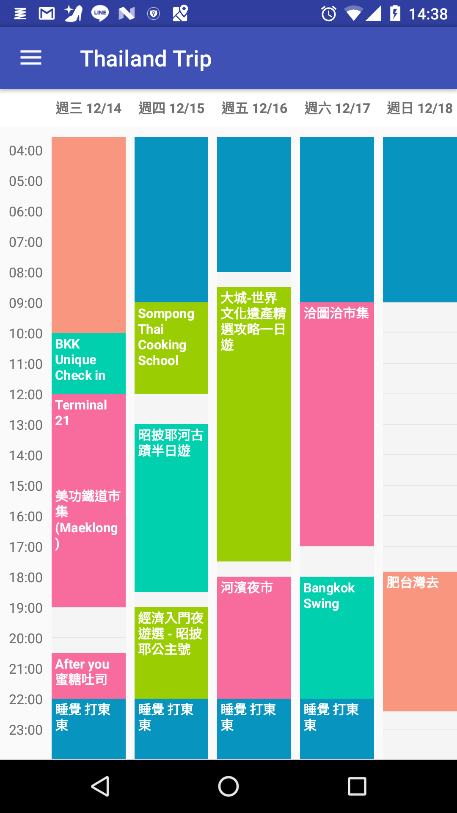
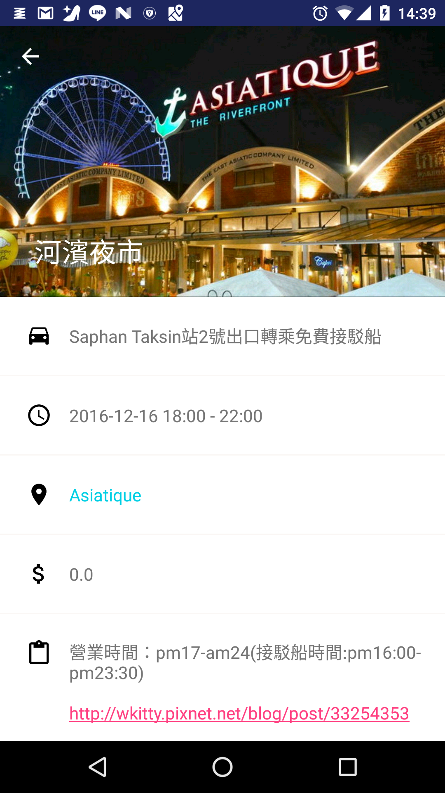
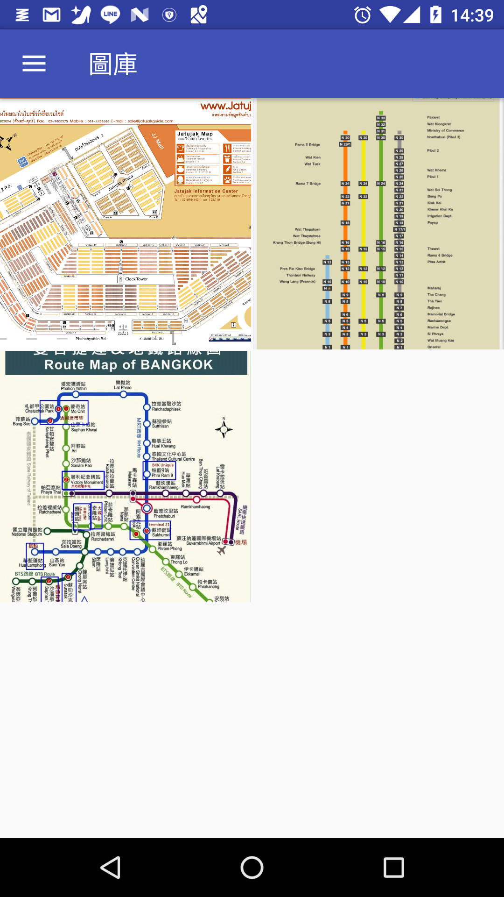

# ThailandTrip
------
這是一個為了去曼谷玩寫的ＡＰＰ，同時也是讓我可以玩各種不同新技術的 side project

## Features
1. 使用Rxjava2, GreenDao 3.2.0, Android Week View
2. 部分使用MVP(沒時間寫完)
3. 全部的Icon 都是 SVG
4. 使用了 CoordinateLayout 與 CollapsingToolbarLayout。
5. 將Fragment之間的轉換抽象化為 Page

## Preview

## Download link
https://drive.google.com/file/d/0B8KnvfgKMoQLZ0JGVklLblpHQk0/view

## TODO list
1. 補單元測試
2. 補ＵＩ測試
3. 使用 Dagger2
